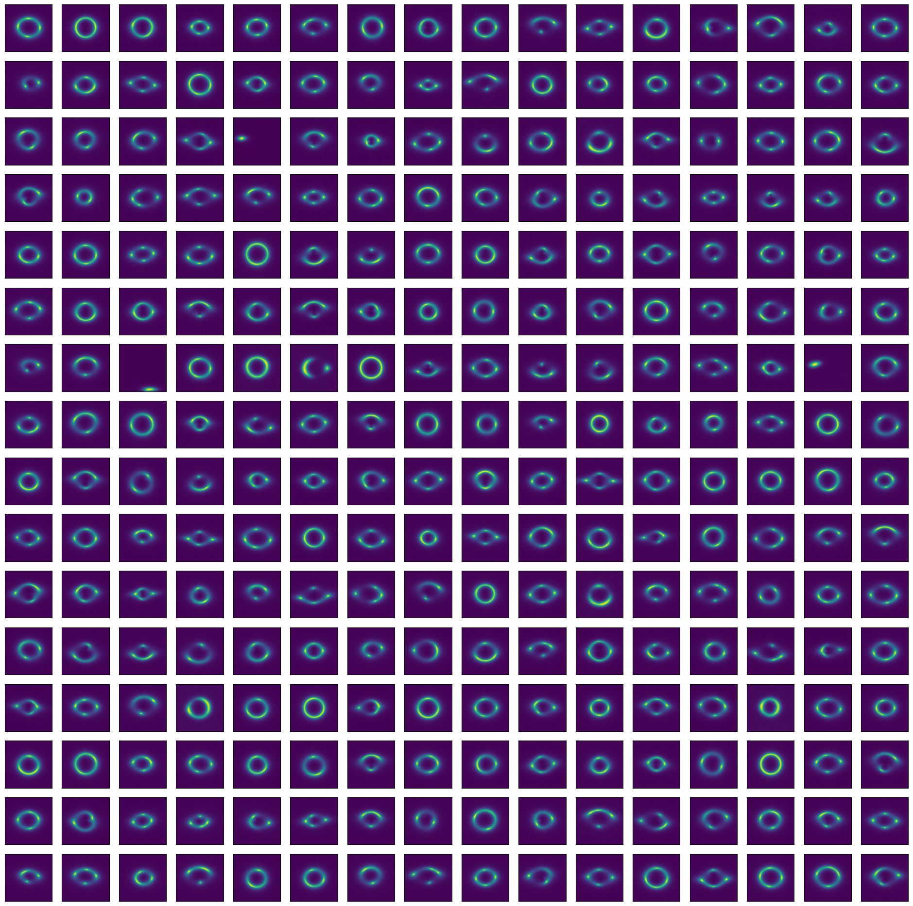
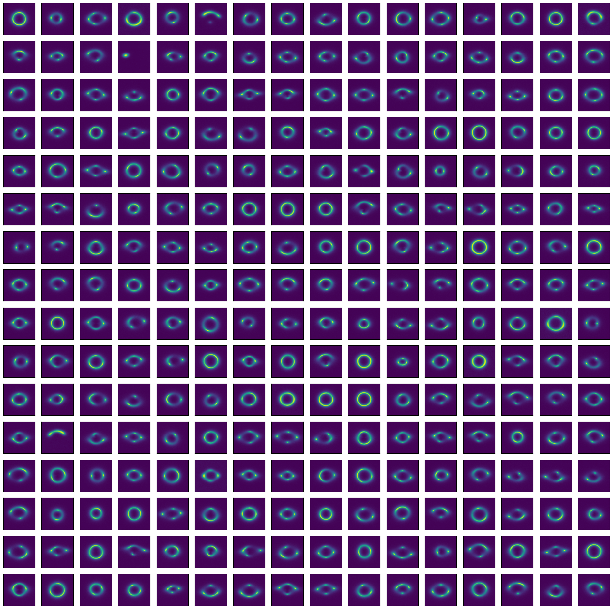

# Specific Test IV. Diffusion Models

Task: Develop a generative model to simulate realistic strong gravitational lensing images. Train a diffusion model (DDPM) to generate lensing images. You are encouraged to explore various architectures and implementations within the diffusion model framework. Please implement your approach in PyTorch or Keras and discuss your strategy.

This can be run through the `Deeplense-Test4.ipynb` in which you can also configure the number of epochs and Unet model.

## Results

I evaluated my results on the FID metric for both the normal model and the EMA model across every single FID layer (64, 192, 768, 2048) due to the lacking quantity of test images(1000 instead of the preferred 2048). Calculations were done in `compute_fids.py` and my results are as follows:

1. Features: 64
   Normal: 0.013559170067310333
   EMA: 0.012785151600837708

2. Features: 192
   Normal: 0.10923877358436584
   EMA: 0.0984046459197998

3. Features: 768
   Normal: 0.04958365485072136
   EMA: 0.04373853653669357

4. Features: 2048
   Normal: 9.121284484863281
   EMA: 8.034904479980469

It can be seen that the EMA model performs consistently better however as a note, these results cannot be taken as 100% due to several facts:

1. The output images had only 1 channel and had to be stacked on top of eachother to be input into the FID(which uses InceptionV3 in the background)
2. FID's background model was trained on ImageNet which is very different from the strong gravitational lensing images present here which could cause the FID computation to be inaccurate

Here are some of the resulting images:

### Normal model:

### EMA model:

